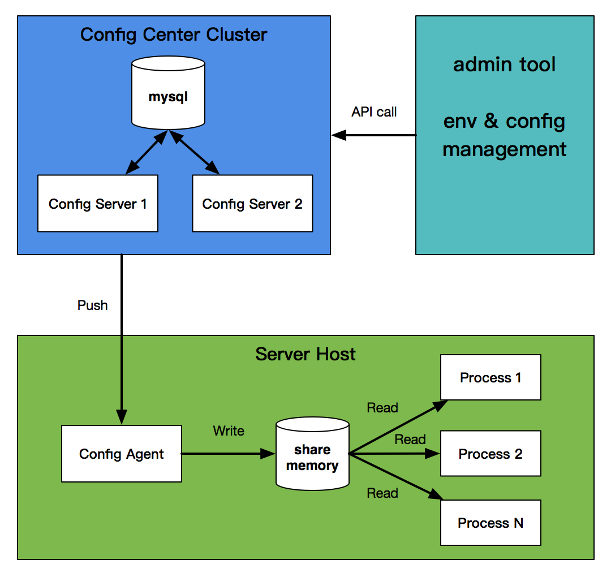

the config server and agent for configuration items.

one config server supports more than 100 thousand concurrent connections / agents,
and the changed configuration items will be pushed to agents within a second.

the config servers are peer-to-peer relationship. env & config storage use mysql.

shared memory use libshmcache, you should config the shared memory type to mmap.

